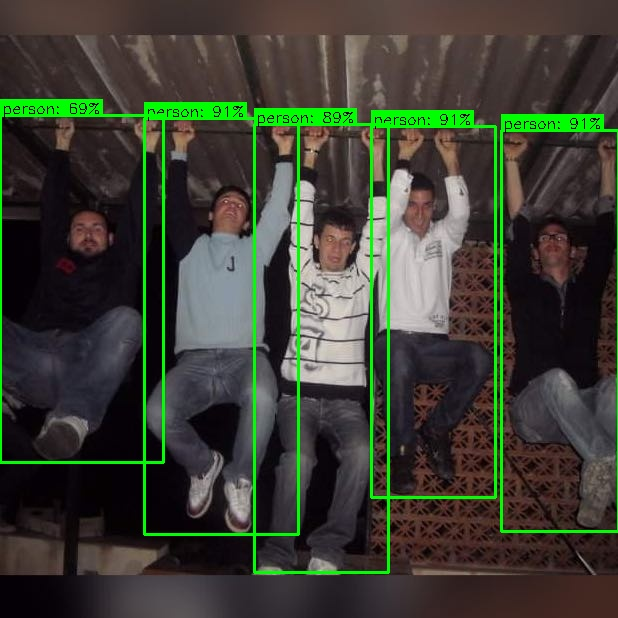
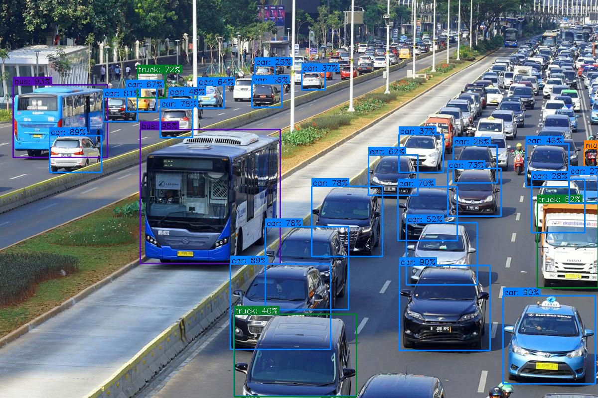
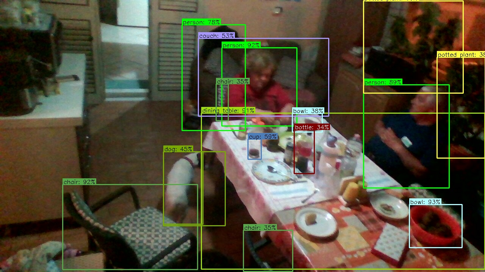
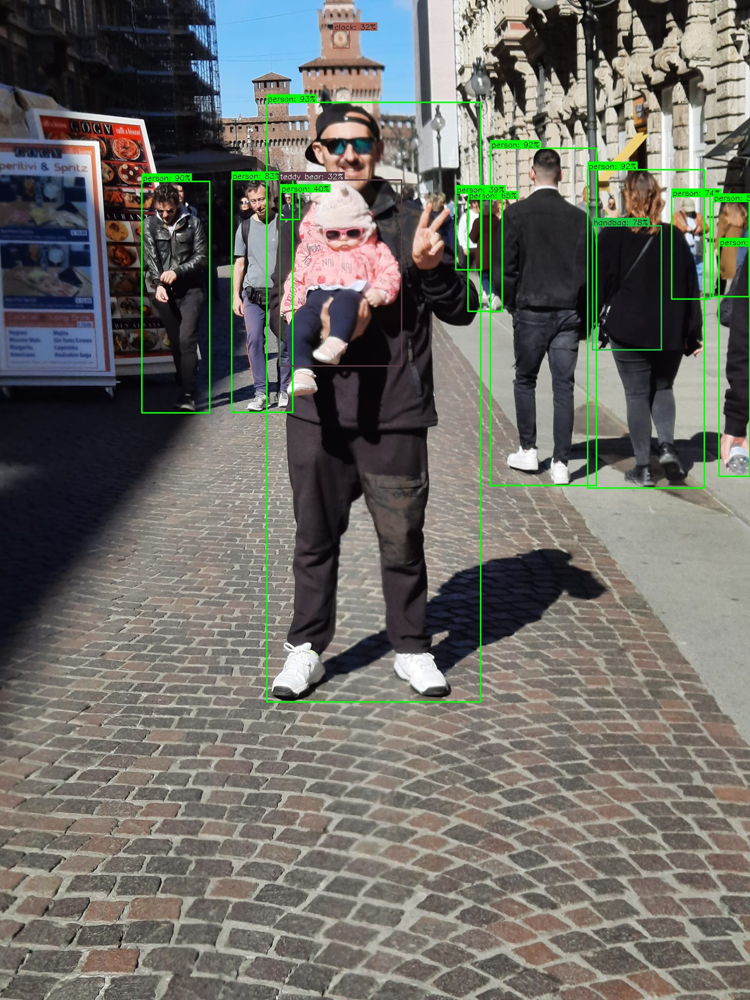
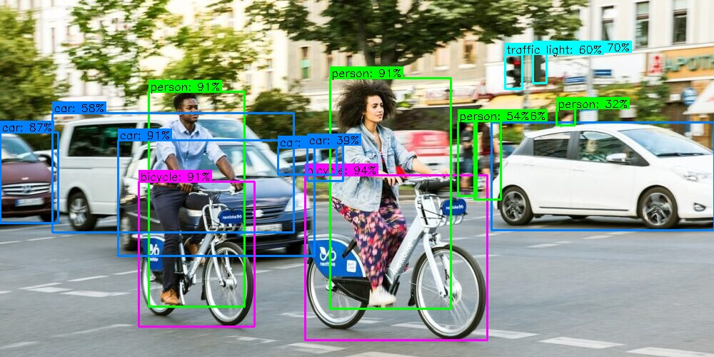
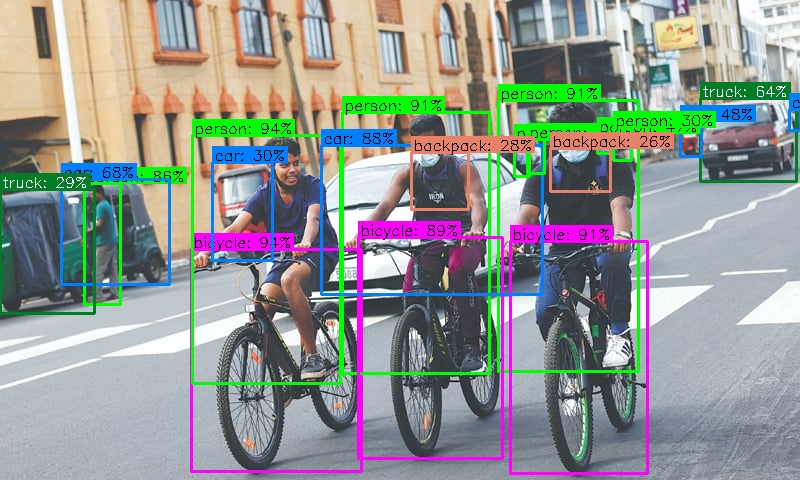
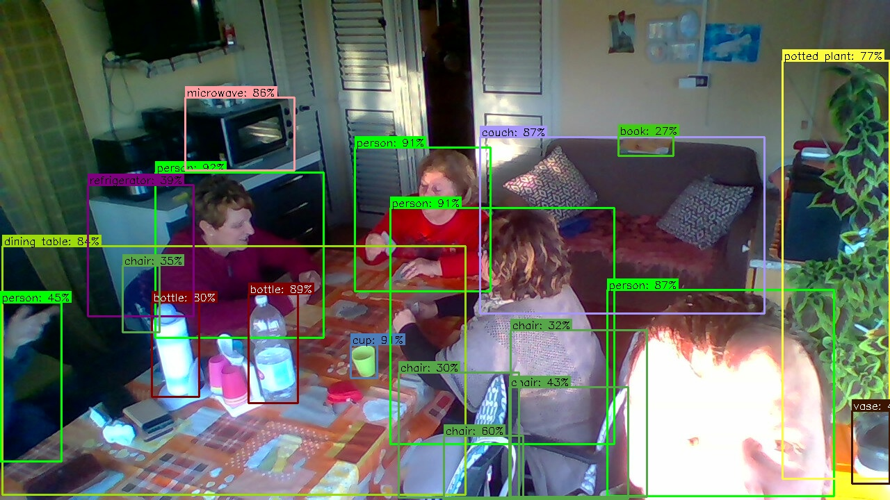

# YOLO Tutorial for Object Detection 

## Introduction

This is a guide to YOLO (You Only Look Once) model for object detection (OD). 

For more details watch the video at [https://youtu.be/WgPbbWmnXJ8](https://youtu.be/WgPbbWmnXJ8)

## Setup

The requirements.txt shows the required python packages to run all scripts in the project.

## Step 0: Download YOLOs

## Step 1: YOLO OD on Images

## Step 2: YOLO OD on live Camera Images

## Step 3: YOLO OD on Videos

### Todo

- step 2
